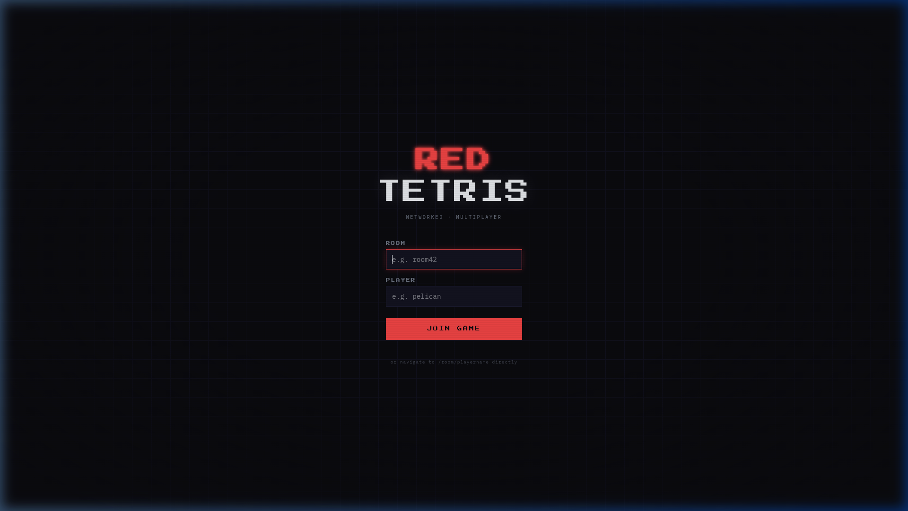
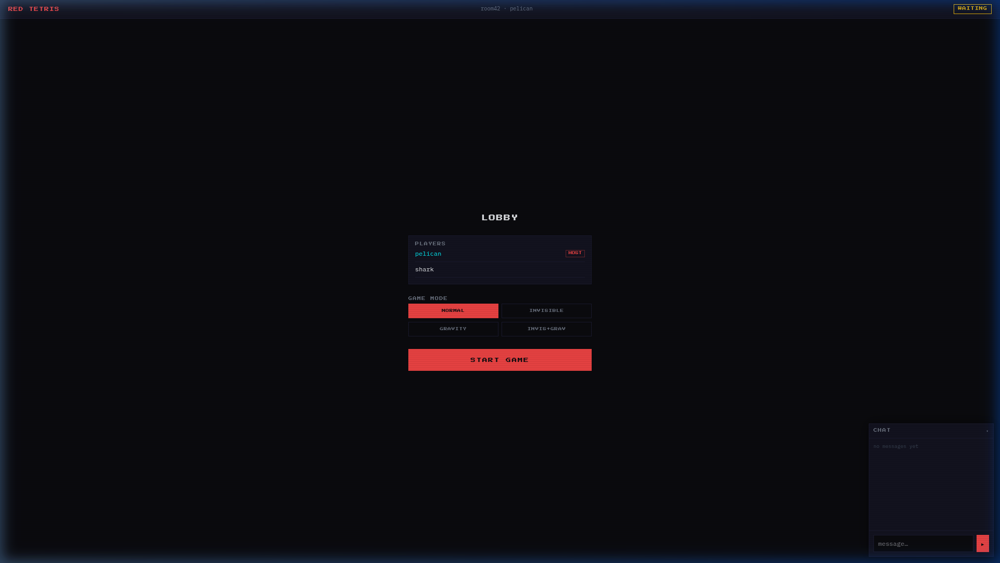
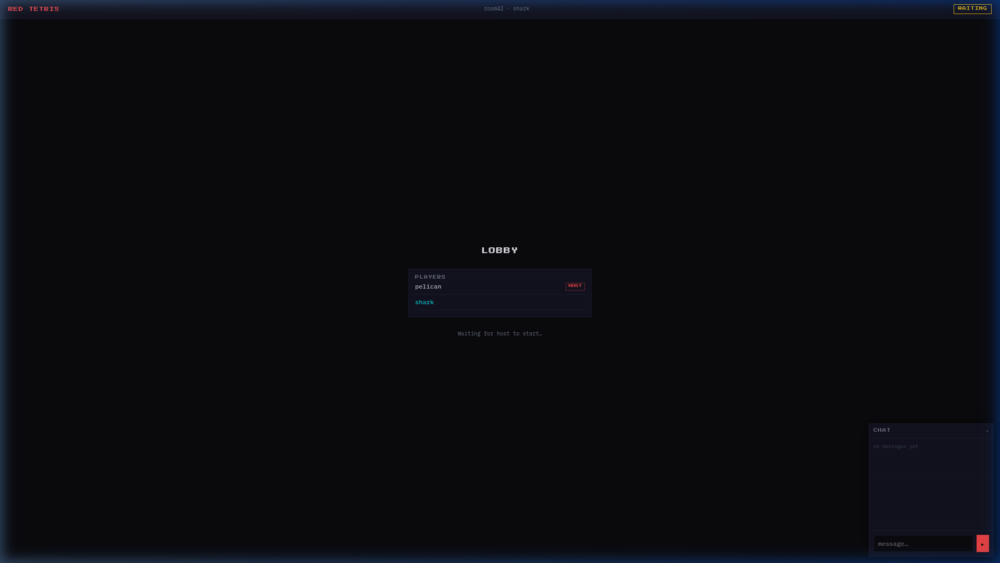
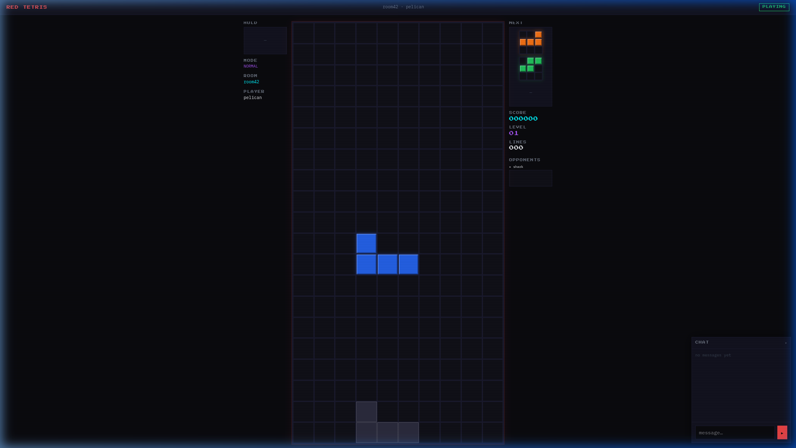

<div align="center">

# 🔴 RED TETRIS

**A real-time, networked multiplayer Tetris game built with React, Node.js, and Socket.io**

[](https://nodejs.org)
[](https://react.dev)
[](https://socket.io)
[](https://vitejs.dev)
[](#testing)
[](#testing)
[](#license)

</div>

---

## 📋 Table of Contents

- [Overview](#overview)
- [Screenshots](#screenshots)
- [Features](#features)
- [Architecture](#architecture)
- [Project Structure](#project-structure)
- [Game Modes](#game-modes)
- [Socket.io Events](#socketio-events)
- [Scoring System](#scoring-system)
- [Prerequisites](#prerequisites)
- [Installation](#installation)
- [Running the Project](#running-the-project)
- [Running Tests](#running-tests)
- [Keyboard Controls](#keyboard-controls)
- [URL Navigation](#url-navigation)
- [Tech Stack](#tech-stack)
- [Contributing](#contributing)
- [License](#license)

---

## Overview

**Red Tetris** is a fully networked, real-time multiplayer Tetris game. Multiple players join a named room and compete simultaneously — all receiving the same piece sequence (ensuring fairness), while clearing lines sends penalty rows to opponents. The host controls the game mode and can start or restart rounds.

The project is split into:
- **Server** — Node.js + Express + Socket.io managing game state, rooms, and real-time events
- **Client** — React + Redux + Vite SPA communicating over WebSockets

---

## Screenshots

### Landing Page
The entry point where players enter a room name and player name to join.



---

### Lobby — Host View
The host sees all joined players, can select a game mode, and starts the game.



---

### Lobby — Player 2 View
Non-host players see the player list and wait for the host to start.



---

### Active Gameplay
The main game screen: your board in the center, HOLD piece on the left, NEXT queue + score + opponent spectrums on the right, and real-time chat in the corner.



---

## Features

| Feature | Description |
|---|---|
| 🌐 **Real-time Multiplayer** | Up to N players per room over WebSockets |
| 🔄 **Synchronized Pieces** | All players receive the same piece sequence — same index, same shape |
| ⚠️ **Penalty Lines** | Clearing 2+ lines sends garbage rows to all opponents |
| 👑 **Host Controls** | First player becomes host; can start, configure, and restart games |
| 🎯 **4 Game Modes** | Normal, Invisible, Gravity, and Invisible+Gravity |
| 👻 **Ghost Piece** | Shows where the active piece will land |
| 🤝 **Hold Piece** | Save the current piece and swap it later |
| 📊 **Opponent Spectrums** | See live column-height silhouettes of all opponents |
| 💬 **In-game Chat** | Real-time chat in every room during lobby and gameplay |
| 🏆 **Persistent Leaderboard** | Top scores saved to `leaderboard.json` across sessions |
| 🚫 **Late-join Protection** | Players who try to join an in-progress game are rejected |
| ↩️ **Auto Host Transfer** | If the host leaves, the next player becomes host automatically |
| ⚡ **Speed Escalation** | In gravity modes, drop speed increases every 30 seconds |

---

## Architecture

```
┌─────────────────────┐      WebSocket / HTTP       ┌──────────────────────────┐
│   React Client      │ ◄──────────────────────────► │   Node.js Server         │
│                     │                              │                          │
│  ┌───────────────┐  │   Socket.io Events:          │  ┌────────────────────┐  │
│  │  Landing Page │  │   → join / start_game        │  │  Game Room Manager │  │
│  │  Lobby        │  │   → board_update             │  │  (Map of Games)    │  │
│  │  PlayField    │  │   → rows_cleared             │  └────────┬───────────┘  │
│  │  Results      │  │   → game_over                │           │              │
│  │  Chat         │  │   ← game_update              │  ┌────────▼───────────┐  │
│  └───────────────┘  │   ← penalty_lines            │  │  Game.js           │  │
│                     │   ← game_started/finished    │  │  Player.js         │  │
│  ┌───────────────┐  │   ← next_pieces              │  │  Piece.js          │  │
│  │  Redux Store  │  │   ← leaderboard              │  │  Leaderboard.js    │  │
│  │  Game Engine  │  │   ← chat_message             │  └────────────────────┘  │
│  └───────────────┘  │                              │                          │
└─────────────────────┘                              └──────────────────────────┘
```

### Key Design Decisions

- **Server-authoritative piece sequence**: The server generates and stores all pieces in an array. Each client requests pieces by index — guaranteeing all players get identical pieces in identical order.
- **Spectrum (not full board) broadcast**: Instead of broadcasting 200 cells per player per frame, only the 10-column spectrum (column heights) is shared. This minimizes network traffic dramatically.
- **Pure game engine**: `src/client/game/engine.js` is entirely side-effect-free pure functions — making it trivially testable and decoupled from React.
- **Room-based isolation**: Each room is an independent `Game` instance. Events are scoped to rooms via Socket.io's `.to(room).emit()` pattern.

---

## Project Structure

```
Red_Tetris/
├── src/
│   ├── server/
│   │   ├── index.js          # Express + Socket.io server, all event handlers
│   │   ├── Game.js           # Game room: state machine, piece pool, scoring
│   │   ├── Player.js         # Player model: board, spectrum, score, host flag
│   │   ├── Piece.js          # Random Tetris piece generator (7 shapes)
│   │   └── Leaderboard.js    # Persist/read top scores from leaderboard.json
│   │
│   └── client/
│       ├── index.html        # HTML entry point
│       ├── main.jsx          # React root, Router setup
│       ├── App.jsx           # Route definitions (/ and /:room/:name)
│       ├── game/
│       │   └── engine.js     # Pure Tetris logic (rotate, collide, lock, clear)
│       ├── hooks/            # Custom React hooks (useSocket, useGameLoop, etc.)
│       ├── styles/
│       │   └── ui.js         # Shared style tokens (fonts, colors, button styles)
│       └── components/
│           ├── Landing.jsx   # Entry form (room + player name)
│           ├── GameRoom.jsx  # Root room component, socket lifecycle
│           ├── Lobby.jsx     # Pre-game waiting room + mode selection
│           ├── PlayField.jsx # Active game layout (board + panels)
│           ├── Board.jsx     # 20×10 board renderer
│           ├── Cell.jsx      # Individual cell with color mapping
│           ├── MiniBoard.jsx # Small piece preview (HOLD / NEXT)
│           ├── Spectrum.jsx  # Opponent column-height visualizer
│           ├── Results.jsx   # Post-game leaderboard + replay button
│           ├── Chat.jsx      # Collapsible real-time chat widget
│           ├── RoomHeader.jsx# Top bar (room, player, status badge)
│           ├── RejectedScreen.jsx # Shown when joining mid-game
│           └── ui/           # Reusable Panel, ScoreItem primitives
│
├── test/
│   └── server/
│       ├── socket.test.js    # Integration tests for all Socket.io events
│       ├── Game.test.js      # Unit tests for Game class
│       ├── Player.test.js    # Unit tests for Player class
│       ├── Leaderboard.test.js # Unit tests for score persistence
│       └── chat.test.js      # Unit tests for chat event
│
├── leaderboard.json          # Persisted high scores (auto-created)
├── vite.config.js            # Vite: React plugin, Tailwind, proxy to :3004
├── vitest.config.js          # Vitest: coverage via v8
└── package.json              # Scripts, dependencies
```

---

## Game Modes

| Mode | Description |
|---|---|
| **Normal** | Classic Tetris. Locked pieces are visible. Drop speed is constant. |
| **Invisible** | Your locked board is hidden — you only see the active piece and ghost. Memory game! |
| **Gravity** | Drop speed accelerates every 30 seconds, pushing players to make faster decisions. |
| **Invisible + Gravity** | Both modifiers combined — the hardest mode. |

The host selects the mode before starting. The mode is broadcast to all players via `game_update`.

---

## Socket.io Events

### Client → Server

| Event | Payload | Description |
|---|---|---|
| `start_game` | `{ mode }` | Host starts the game with selected mode |
| `request_pieces` | `currentLength` | Request 3 more pieces starting at index |
| `board_update` | `board` | Send updated 20×10 board after each piece move |
| `rows_cleared` | `{ count, softDropCells, hardDropCells }` | Report cleared lines for scoring + penalties |
| `game_over` | — | Client signals their board has filled up |
| `restart_game` | — | Host resets the room to WAITING state |
| `get_leaderboard` | — | Request the current leaderboard |
| `chat_message` | `text` | Send a chat message to the room |

### Server → Client

| Event | Payload | Description |
|---|---|---|
| `game_update` | `GameState` | Full room state broadcast after any change |
| `game_started` | — | Tells all clients to switch to game view |
| `game_finished` | `{ leaderboard }` | Game ended; includes final leaderboard |
| `game_restarted` | — | Room reset; clients return to lobby |
| `next_pieces` | `{ pieces: [p0, p1, p2] }` | Delivers next 3 pieces from server pool |
| `penalty_lines` | `count` | Add N garbage rows to the recipient's board |
| `speed_update` | `speed` | New drop interval in ms (gravity modes) |
| `leaderboard` | `[{ name, score }]` | Leaderboard entries (top 10) |
| `join_rejected` | `{ reason }` | Connection rejected (game in progress) |
| `chat_message` | `{ name, text, time }` | Broadcast chat message to the room |

---

## Scoring System

Scoring follows the classic Nintendo scoring table plus drop bonuses:

| Lines Cleared | Base Points |
|---|---|
| 1 line | 100 |
| 2 lines | 300 |
| 3 lines | 500 |
| 4 lines (Tetris) | 800 |

**Drop Bonuses:**
- **Soft drop**: +1 point per cell dropped manually
- **Hard drop**: +2 points per cell dropped instantly

```js
score = LINE_POINTS[linesCleared] + softDropCells + hardDropCells * 2
```

Penalty lines are sent to **all other players** when a player clears **2 or more** lines at once (`count - 1` penalty rows).

---

## Prerequisites

Make sure you have the following installed:

- **Node.js** v18+ (v22 recommended)
- **npm** v9+

```bash
node --version  # v22.x.x
npm --version   # 9.x.x or higher
```

---

## Installation

```bash
# Clone the repository
git clone https://github.com/your-username/Red_Tetris.git
cd Red_Tetris

# Install all dependencies
npm install
```

---

## Running the Project

Red Tetris runs as two concurrent processes:
1. **The Socket.io/Express server** (port `3004`) — manages game state
2. **The Vite dev server** (port `3000`) — serves the React client and proxies socket connections

### Development Mode (recommended)

Open **two terminal windows**:

**Terminal 1 — Start the backend:**
```bash
npm run dev
# or: node src/server/index.js
# Listening on http://localhost:3004
```

**Terminal 2 — Start the frontend:**
```bash
npm run client
# Vite dev server running at http://localhost:3000
```

Then open your browser at **http://localhost:3000**.

To simulate multiplayer, open **multiple browser tabs** with different player names in the same room:
```
http://localhost:3000/room42/alice
http://localhost:3000/room42/bob
```

### Production Build

```bash
# Build the React client into dist/client/
npm run build

# Run the production server (serves built client + WebSocket)
npm start
# Server running at http://localhost:3004
```

---

## Running Tests

The project uses **Vitest** with **v8 coverage**. All tests target server-side logic.

```bash
# Run all tests with coverage report
npm test

# or explicitly:
npm run coverage
```

### Test Results

```
 Test Files  5 passed (5)
      Tests  41 passed (41)
   Duration  3.49s

 % Coverage report from v8
 ----------------|---------|----------|---------|---------|
 File            | % Stmts | % Branch | % Funcs | % Lines |
 ----------------|---------|----------|---------|---------|
 All files       |   89.78 |    82.85 |   85.36 |   89.59 |
  Game.js        |   79.66 |     100  |      80 |   79.62 |
  Leaderboard.js |   94.44 |     100  |     100 |   93.33 |
  Piece.js       |     100 |     100  |     100 |     100 |
  Player.js      |     100 |     100  |     100 |     100 |
  index.js       |    93.4 |      75  |   85.71 |   93.18 |
 ----------------|---------|----------|---------|---------|
```

### Test Coverage Breakdown

| Test File | What it covers |
|---|---|
| `socket.test.js` | All 17 Socket.io event flows: join, start, board_update, rows_cleared, game_over, disconnect, chat, rejections |
| `Game.test.js` | Game state machine: start, addPlayer, removePlayer, getPiece, calcScore, getState |
| `Player.test.js` | Player construction, spectrum calculation, board management |
| `Leaderboard.test.js` | Score persistence, top-10 ranking, file read/write |
| `chat.test.js` | Chat broadcast, empty message rejection, text trimming |

---

## Keyboard Controls

| Key | Action |
|---|---|
| `←` / `→` | Move piece left / right |
| `↑` or `Z` | Rotate clockwise |
| `↓` | Soft drop (1 cell, +1 point) |
| `Space` | Hard drop (instant, +2 pts/cell) |
| `C` | Hold current piece |

The controls are displayed at the bottom of the game board during play.

---

## URL Navigation

Players can join a room directly via URL — no form required:

```
http://localhost:3000/{roomName}/{playerName}
```

**Examples:**
```
http://localhost:3000/room42/alice     → Alice joins room42
http://localhost:3000/finals/bob      → Bob joins the finals room
http://localhost:3000/test/player1    → player1 joins test room
```

**Validation rules:**
- Room name and player name: letters, numbers, `-` and `_` only
- Maximum 20 characters each

---

## Tech Stack

### Frontend
| Technology | Version | Purpose |
|---|---|---|
| React | 19 | UI component framework |
| React Router DOM | 7 | Client-side routing (`/room/player`) |
| Redux Toolkit | 2.12 | Global game state (queue, hold, etc.) |
| React Redux | 9 | React–Redux binding |
| Socket.io Client | 4.8 | WebSocket communication |
| Vite | 8 | Dev server, bundler, HMR |
| Tailwind CSS | 4 | Utility CSS (minimal usage, design tokens) |
| Lucide React | 1.21 | Icon library |

### Backend
| Technology | Version | Purpose |
|---|---|---|
| Node.js | 22+ | JavaScript runtime |
| Express | 5 | HTTP server, static file serving |
| Socket.io | 4.8 | WebSocket server, rooms, events |
| nodemon | 3 | Auto-restart during development |

### Testing
| Technology | Version | Purpose |
|---|---|---|
| Vitest | 4 | Test runner (Vite-native) |
| @vitest/coverage-v8 | 4 | Code coverage via V8 |

---

## Contributing

Contributions are welcome! Please follow these steps:

1. **Fork** the repository
2. **Create** a feature branch: `git checkout -b feature/my-feature`
3. **Write tests** for any new server logic
4. **Run** the full test suite: `npm test`
5. **Commit** your changes: `git commit -m 'feat: add my feature'`
6. **Push** to your branch: `git push origin feature/my-feature`
7. **Open** a Pull Request

### Code Style Guidelines
- Use `const` by default; `let` only when reassignment is needed
- Arrow functions for callbacks
- ES Modules (`import`/`export`) throughout
- Keep server logic in `src/server/`, client logic in `src/client/`
- All new server-side features must have corresponding Vitest tests

---

## License

This project is licensed under the **MIT License**.

```
MIT License

Copyright (c) 2026 Red Tetris Contributors

Permission is hereby granted, free of charge, to any person obtaining a copy
of this software and associated documentation files (the "Software"), to deal
in the Software without restriction, including without limitation the rights
to use, copy, modify, merge, publish, distribute, sublicense, and/or sell
copies of the Software, and to permit persons to whom the Software is
furnished to do so, subject to the following conditions:

The above copyright notice and this permission notice shall be included in all
copies or substantial portions of the Software.

THE SOFTWARE IS PROVIDED "AS IS", WITHOUT WARRANTY OF ANY KIND, EXPRESS OR
IMPLIED, INCLUDING BUT NOT LIMITED TO THE WARRANTIES OF MERCHANTABILITY,
FITNESS FOR A PARTICULAR PURPOSE AND NONINFRINGEMENT. IN NO EVENT SHALL THE
AUTHORS OR COPYRIGHT HOLDERS BE LIABLE FOR ANY CLAIM, DAMAGES OR OTHER
LIABILITY, WHETHER IN AN ACTION OF CONTRACT, TORT OR OTHERWISE, ARISING FROM,
OUT OF OR IN CONNECTION WITH THE SOFTWARE OR THE USE OR OTHER DEALINGS IN THE
SOFTWARE.
```

---

<div align="center">

Built with ❤️ using React · Node.js · Socket.io

</div>